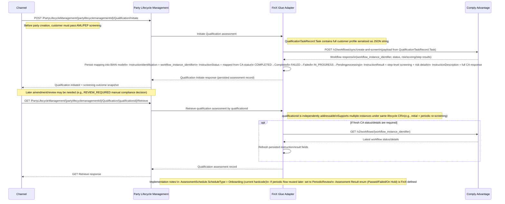

```mermaid
sequenceDiagram
    participant channel as Channel
    participant plm as Party Lifecycle Management
    participant finx as FinX Glue Adapter
    participant ca as Comply Advantage


    channel->>plm: POST /PartyLifecycleManagement/{partylifecyclemanagementId}/Qualification/Initiate
    Note right of channel: Before party creation, customer must pass AML/PEP screening

    plm->>finx: Initiate Qualification assessment
    Note right of finx: QualificationTaskRecord.Task contains full customer profile serialized as JSON string

    finx->>ca: POST /v2/workflows/sync/create-and-screen\n(payload from QualificationTaskRecord.Task)
    ca-->>finx: Workflow response\n(workflow_instance_identifier, status, risk/scoring/step results)

    finx->>finx: Persist mapping into BIAN model\n- InstructionIdentification = workflow_instance_identifier\n- InstructionStatus = mapped from CA status\n  COMPLETED→Completed\n  FAILED→Failed\n  IN_PROGRESS→Pendingprocessing\n- InstructionResult = step-level screening + risk details\n- InstructionDescription = full CA response
    finx-->>plm: Qualification Initiate response (persisted assessment record)
    plm-->>channel: Qualification initiated + screening outcome snapshot

    Note over channel,plm: Later amendment/review may be needed (e.g., REVIEW_REQUIRED manual compliance decision)

    channel->>plm: GET /PartyLifecycleManagement/{partylifecyclemanagementId}/Qualification/{qualificationid}/Retrieve
    plm->>finx: Retrieve qualification assessment by qualificationid
    Note right of finx: qualificationid is independently addressable\nSupports multiple instances under same lifecycle CR\n(e.g., initial + periodic re-screening)

    opt If fresh CA status/details are required
        finx->>ca: GET /v2/workflows/{workflow_instance_identifier}
        ca-->>finx: Latest workflow status/details
        finx->>finx: Refresh persisted instruction/result fields
    end

    finx-->>plm: Qualification assessment record
    plm-->>channel: GET Retrieve response

    Note over finx: Implementation notes:\n- AssessmentSchedule.ScheduleType = Onboarding (current hardcode)\n- If periodic flow reused later: set to PeriodicReview\n- Assessment Result enum (Passed/Failed/On Hold) is FinX-defined
```
