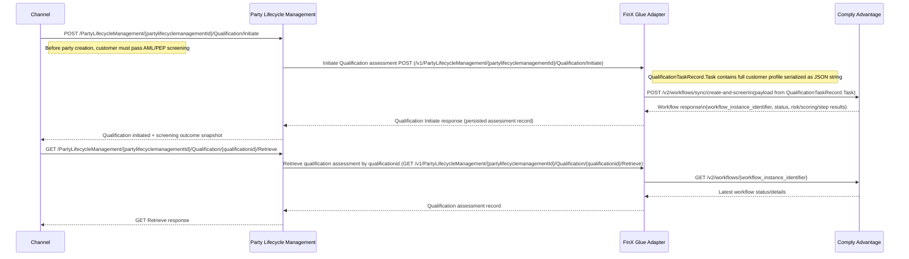

# AML/PEP Qualification Flow (BIAN + Comply Advantage + FinX Glue)

## Explanation

### 1. Initiate AML/PEP Qualification from Channel

**API:** `POST /PartyLifecycleManagement/{partylifecyclemanagementId}/Qualification/Initiate`

**Trigger:** Before party creation, the channel triggers qualification to ensure the customer passes AML/PEP screening. The request is sent with the party lifecycle context.

---

### 2. Transfer Request from Party Lifecycle Management SD to FinX Glue Adapter

**API:** `POST /v1/PartyLifecycleManagement/{partylifecyclemanagementId}/Qualification/Initiate`

The Party Lifecycle Management BIAN service receives the qualification initiation call and forwards it to the FinX Glue Adapter. `QualificationTaskRecord.Task` contains the full customer profile serialized as a JSON string.

---

### 3. Integration to Comply Advantage Screening Workflow

**API:** `POST /v2/workflows/sync/create-and-screen`

The adapter maps the qualification payload to Comply Advantage format and calls `create-and-screen` for synchronous AML/PEP evaluation.

**Output:** Comply Advantage returns `workflow_instance_identifier`, `status`, and risk/scoring/step results.

---

### 4. Comply Advantage Returns Workflow Outcome

**API Response:** `workflow_instance_identifier`, `status`, and risk/scoring/step results

The adapter persists the assessment snapshot and returns the qualification initiate response back to PLM, which then returns the qualification initiated outcome to the channel.

---

### 5. Retrieve Qualification Status/Details from Channel

**API:** `GET /PartyLifecycleManagement/{partylifecyclemanagementId}/Qualification/{qualificationid}/Retrieve`

**Trigger:** The channel calls retrieve to fetch the latest qualification status for the same party lifecycle and qualification ID.

---

### 6. Transfer Retrieve Request from Party Lifecycle Management SD to FinX Glue Adapter

**API:** `GET /v1/PartyLifecycleManagement/{partylifecyclemanagementId}/Qualification/{qualificationid}/Retrieve`

PLM forwards the retrieve request to the adapter service to obtain the latest screening details.

---

### 7. Integration to Comply Advantage Workflow Retrieval

**API:** `GET /v2/workflows/{workflow_instance_identifier}`

The adapter resolves the stored `workflow_instance_identifier` for the qualification and fetches the latest workflow state/details from Comply Advantage.

---

### 8. Final Output

**`200 OK`** — The qualification assessment record and latest AML/PEP screening status are returned to the channel via PLM and FinX Glue Adapter.
