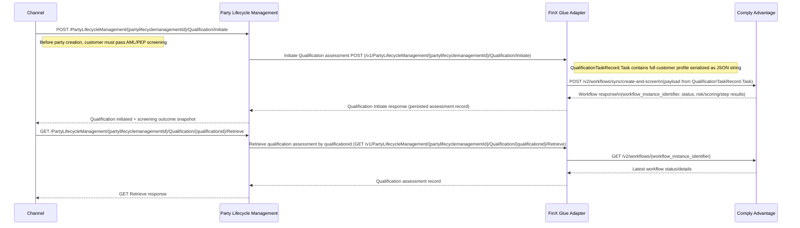

Explanation:

Initiate AML/PEP qualification from channel

API: POST /PartyLifecycleManagement/{partylifecyclemanagementId}/Qualification/Initiate

Trigger: Before party creation, channel triggers qualification to ensure customer passes AML/PEP screening. The request is sent with the party lifecycle context.

Transfer request from PLM BIAN service to FinX Glue Adapter

API: POST /v1/PartyLifecycleManagement/{partylifecyclemanagementId}/Qualification/Initiate

PLM service receives the qualification initiation call and forwards it to FinX Glue Adapter. QualificationTaskRecord.Task contains the full customer profile serialized as a JSON string.

Integration to Comply Advantage screening workflow

API: POST /v2/workflows/sync/create-and-screen

Adapter maps the qualification payload to Comply Advantage format and calls create-and-screen for synchronous AML/PEP evaluation.

Comply Advantage returns workflow outcome

API Response: workflow_instance_identifier, status, and risk/scoring/step results

Adapter persists the assessment snapshot and returns the qualification initiate response back to PLM, which then returns qualification initiated outcome to channel.

Retrieve qualification status/details from channel

API: GET /PartyLifecycleManagement/{partylifecyclemanagementId}/Qualification/{qualificationid}/Retrieve

Trigger: Channel calls retrieve to fetch latest qualification status for the same party lifecycle and qualification id.

Transfer retrieve request from PLM BIAN service to FinX Glue Adapter

API: GET /v1/PartyLifecycleManagement/{partylifecyclemanagementId}/Qualification/{qualificationid}/Retrieve

PLM forwards the retrieve request to adapter service to obtain latest screening details.

Integration to Comply Advantage workflow retrieval

API: GET /v2/workflows/{workflow_instance_identifier}

Adapter resolves the stored workflow_instance_identifier for the qualification and fetches latest workflow state/details from Comply Advantage.

Output:

200 OK with qualification assessment record and latest AML/PEP screening status pushed back to channel via PLM and FinX Glue Adapter.