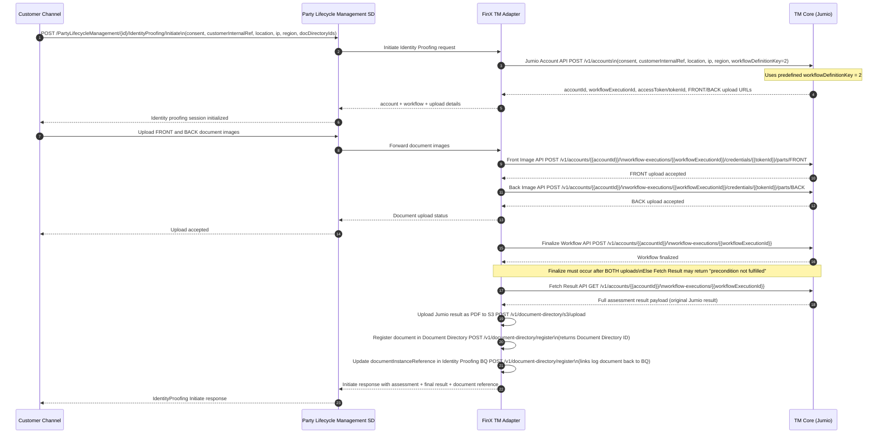

# Identity Verification

## End-to-end Identity Proofing Flow (BIAN + Jumio + FinX Glue)

## API Reference

### Jumio API Endpoints

| Step | API | Details | Jumio Endpoint |
|------|-----|---------|----------------|
| 1 | **Jumio Account API** | Call the Jumio Account Creation API with user consent, customer internal reference, location, IP, region, and workflow definition key (2). The response provides the workflow execution ID, access token, and upload URLs for front and back images. Use this response to start uploading documentation. | `POST https://account.emea-1.jumio.ai/api/v1/accounts` |
| 2 | **Front Image API** | Upload the front image to Jumio using the front image upload URL, workflow execution Id and access token from the Account API response. Send the file as a multipart request in JPG or PNG format. | `POST https://api.emea-1.jumio.ai/api/v1/accounts/{{accountId}}/workflow-executions/{{workflowExecutionId}}/credentials/{{tokenId}}/parts/FRONT` |
| 3 | **Back Image API** | Upload the back image to Jumio using the back image upload URL, workflow execution Id and access token from the Account API response. Send the file as a multipart request in JPG or PNG format. | `POST https://api.emea-1.jumio.ai/api/v1/accounts/{{accountId}}/workflow-executions/{{workflowExecutionId}}/credentials/{{tokenId}}/parts/BACK` |
| 4 | **Finalize Workflow API** | Call the Jumio Finalize Workflow API to indicate all credential parts are uploaded and verification can proceed. Both images must be uploaded before this call; otherwise, Jumio returns a "precondition not fulfilled" error in the FetchResult API. | `POST https://api.emea-1.jumio.ai/api/v1/accounts/{{accountId}}/workflow-executions/{{workflowExecutionId}}` |
| 5 | **Fetch Result API** | Call the Jumio Fetch Result API with the workflow execution Id and account ID. | `GET https://retrieval.emea-1.jumio.ai/api/v1/accounts/{{accountId}}/workflow-executions/{{workflowExecutionId}}` |

### FinX Glue API Endpoints

| Step | API | Details | FinX Glue Endpoint |
|------|-----|---------|-------------------|
| 6 | **Generate the Jumio result object as a PDF document and save to S3** | The same full Fetch Result response payload is uploaded to S3 as a document (the Identity Proofing Log document). | `POST https://gatewayqa.ustfinx.com/v1/document-directory/s3/upload` |
| 7 | **Register document in Document Directory** | The S3 document's URL is registered into Document Directory, tagged as an Identity Proofing Log, using the Party ID and Assessment ID (if applicable). Document Directory returns a new Document Directory ID for this log document. | `POST https://gatewayqa.ustfinx.com/v1/document-directory/register` |
| 8 | **Update document ID reference in Identity Proofing BQ** | The Document Directory ID from Step 7 is updated into the documentInstanceReference object of the Identity Proofing BQ record, linking the log document back to the BQ. | `POST https://gatewayqa.ustfinx.com/v1/document-directory/register` |

## Notes

- The adapter determines the **final decision** based on the Jumio **original result**.
- Both **assessment result** and **final result** are stored in the **Party Lifecycle Management** store.
- The **original Jumio result** must be converted/stored as a **PDF log document**, registered in Document Directory, and linked back to the Identity Proofing BQ to appear in CAM Documents tab.
