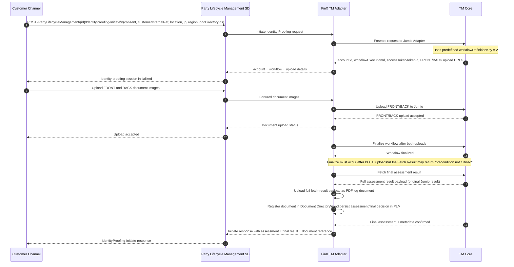

# Identity Verification

## End-to-end Identity Proofing Flow (BIAN + Jumio + FinX Glue)

## Notes

- The adapter determines the **final decision** based on the Jumio **original result**.
- Both **assessment result** and **final result** are stored in the **Party Lifecycle Management** store.
- The **original Jumio result** must be converted/stored as a **PDF log document**, registered in Document Directory, and linked back to the Identity Proofing BQ to appear in CAM Documents tab.
