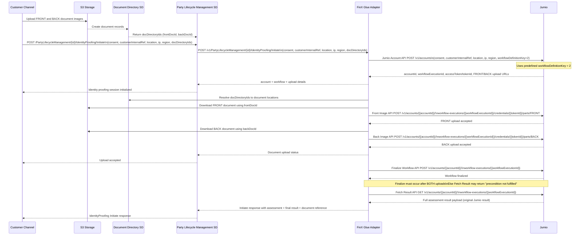

# Identity Verification

## End-to-end Identity Proofing Flow (BIAN + Jumio + FinX Glue)

## Explanation

### 1. Document Upload and Document Directory Registration

The Customer Channel uploads both FRONT and BACK identity document images to S3.

S3 then creates document records in the Document Directory SD, and the Document Directory returns `docDirectoryIds` (`frontDocId` and `backDocId`) to **Party Lifecycle Management SD** as shown in the sequence.

---

### 2. Identity Proofing Initiation from Customer Channel

**API:** `POST /PartyLifecycleManagement/{id}/IdentityProofing/Initiate`

The Customer Channel sends the Initiate request to Party Lifecycle Management SD with:
- Consent
- Customer internal reference
- Location, IP, and region
- `docDirectoryIds`

---

### 3. Internal Forwarding to FinX Glue Adapter

**API (forwarded):** `POST /v1/PartyLifecycleManagement/{id}/IdentityProofing/Initiate`

Party Lifecycle Management SD forwards the initiation payload to FinX Glue Adapter so it can orchestrate the Jumio flow.

---

### 4. Jumio Account Creation

**API:** `POST https://account.emea-1.jumio.ai/api/v1/accounts`

FinX Glue calls Jumio Account API with consent and customer context details, using `workflowDefinitionKey=2`.

Jumio returns:
- `accountId`
- `workflowExecutionId`
- `accessToken` / `tokenId`
- FRONT/BACK upload endpoints

FinX Glue sends these session details back to Party Lifecycle Management SD, which then confirms to the Customer Channel that the identity proofing session is initialized.

---

### 5. FRONT Document Upload to Jumio

FinX Glue resolves `docDirectoryIds` via Document Directory SD to obtain document locations.

Then FinX Glue downloads the FRONT document from S3 and uploads it to Jumio:

**API:** `POST https://api.emea-1.jumio.ai/api/v1/accounts/{{accountId}}/workflow-executions/{{workflowExecutionId}}/credentials/{{tokenId}}/parts/FRONT`

Jumio responds that FRONT upload is accepted.

---

### 6. BACK Document Upload to Jumio

FinX Glue downloads the BACK document from S3 using `backDocId` and uploads it to Jumio:

**API:** `POST https://api.emea-1.jumio.ai/api/v1/accounts/{{accountId}}/workflow-executions/{{workflowExecutionId}}/credentials/{{tokenId}}/parts/BACK`

Jumio responds that BACK upload is accepted.

FinX Glue sends document upload status to Party Lifecycle Management SD, and Party Lifecycle Management SD notifies the Customer Channel that upload is accepted.

---

### 7. Workflow Finalization

**API:** `POST https://api.emea-1.jumio.ai/api/v1/accounts/{{accountId}}/workflow-executions/{{workflowExecutionId}}`

After both FRONT and BACK uploads are accepted, FinX Glue calls Jumio Finalize Workflow API.

> ⚠️ **Important:** Finalize must happen only after both uploads. Otherwise, subsequent result retrieval can fail with `"precondition not fulfilled"`.

---

### 8. Verification Result Retrieval

**API:** `GET https://retrieval.emea-1.jumio.ai/api/v1/accounts/{{accountId}}/workflow-executions/{{workflowExecutionId}}`

FinX Glue fetches the full assessment output from Jumio.

Jumio returns the original full assessment result payload.

---

### 9. Final Response Back to Customer Channel

FinX Glue returns the Initiate response (assessment + final result + document reference) to Party Lifecycle Management SD, and Party Lifecycle Management SD returns `IdentityProofing Initiate` response to the Customer Channel.

---
