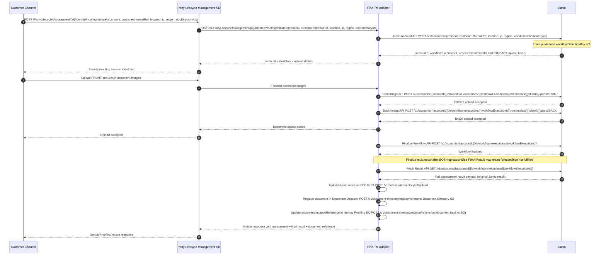

# Identity Verification

## End-to-end Identity Proofing Flow (BIAN + Jumio + FinX Glue)

## Explanation

### 1. Initiate Identity Proofing from Customer Channel

**API:** `POST /PartyLifecycleManagement/{id}/IdentityProofing/Initiate`

**Trigger:** The Customer Channel initiates the identity proofing session by calling the Party Lifecycle Management SD with the customer's consent, internal reference, location, IP address, region, and any existing document directory IDs.

---

### 2. Transfer Request from Party Lifecycle Management SD to FinX TM Adapter

**API:** `POST /PartyLifecycleManagement/{id}/IdentityProofing/Initiate` (forwarded internally)

The Party Lifecycle Management BIAN service, upon receiving the request, forwards it to the FinX TM Adapter service to begin the Jumio verification workflow.

---

### 3. Step 1 — Jumio Account API (Integration to Jumio via TM Core)

**API:** `POST https://account.emea-1.jumio.ai/api/v1/accounts`

The FinX TM Adapter transforms and forwards the request to Jumio's Account Creation API with the following details:
- User consent
- Customer internal reference
- Location, IP, and region
- Workflow definition key (fixed as `2`)

**Output:** Jumio returns `accountId`, `workflowExecutionId`, `accessToken`/`tokenId`, and FRONT/BACK image upload URLs. These are passed back to the channel to confirm the session is initialized.

---

### 4. Step 2 — Front Image Upload

**API:** `POST https://api.emea-1.jumio.ai/api/v1/accounts/{{accountId}}/workflow-executions/{{workflowExecutionId}}/credentials/{{tokenId}}/parts/FRONT`

The Customer Channel uploads the front side of the identity document. The FinX TM Adapter forwards this to Jumio as a multipart request using the upload URL returned in Step 1.

**Output:** Jumio acknowledges FRONT image upload acceptance.

---

### 5. Step 3 — Back Image Upload

**API:** `POST https://api.emea-1.jumio.ai/api/v1/accounts/{{accountId}}/workflow-executions/{{workflowExecutionId}}/credentials/{{tokenId}}/parts/BACK`

The back side of the identity document is uploaded similarly. The FinX TM Adapter forwards it to Jumio as a multipart request.

**Output:** Jumio acknowledges BACK image upload acceptance. The channel is notified that both uploads are accepted.

---

### 6. Step 4 — Finalize Workflow

**API:** `POST https://api.emea-1.jumio.ai/api/v1/accounts/{{accountId}}/workflow-executions/{{workflowExecutionId}}`

Once both FRONT and BACK images are uploaded, the FinX TM Adapter calls Jumio's Finalize Workflow API to signal that all credential parts are ready and verification can proceed.

> ⚠️ **Important:** Both images must be uploaded before this call. Calling Finalize prematurely may result in a `"precondition not fulfilled"` error when fetching results.

---

### 7. Step 5 — Fetch Verification Result

**API:** `GET https://retrieval.emea-1.jumio.ai/api/v1/accounts/{{accountId}}/workflow-executions/{{workflowExecutionId}}`

The FinX TM Adapter retrieves the full verification result from Jumio using the account ID and workflow execution ID.

**Output:** The full assessment result payload (the original Jumio result) is returned to the adapter.

---

### 8. Step 6 — Upload Jumio Result as PDF to S3

**API:** `POST https://gatewayqa.ustfinx.com/v1/document-directory/s3/upload`

The adapter converts the full Fetch Result response payload into a PDF document (the Identity Proofing Log) and uploads it to S3 for persistent storage.

---

### 9. Step 7 — Register Document in Document Directory

**API:** `POST https://gatewayqa.ustfinx.com/v1/document-directory/register`

The S3 document URL is registered in the FinX Document Directory, tagged as an Identity Proofing Log and associated with the Party ID and Assessment ID (if applicable).

**Output:** A Document Directory ID is returned for the registered document.

---

### 10. Step 8 — Link Document Back to Identity Proofing BQ

**API:** `POST https://gatewayqa.ustfinx.com/v1/document-directory/register`

The Document Directory ID from Step 7 is written into the `documentInstanceReference` field of the Identity Proofing Behaviour Qualifier (BQ) record. This links the log document back to the BQ so it appears in the CAM Documents tab.

---

### 11. Final Output

**`200 OK`** — The FinX TM Adapter returns the complete Initiate response (assessment result + final decision + document reference) through the Party Lifecycle Management SD back to the Customer Channel.

---

## Notes

- The adapter determines the **final decision** based on the Jumio **original result**.
- Both **assessment result** and **final result** are stored in the **Party Lifecycle Management** store.
- The **original Jumio result** must be converted/stored as a **PDF log document**, registered in Document Directory, and linked back to the Identity Proofing BQ to appear in CAM Documents tab.
