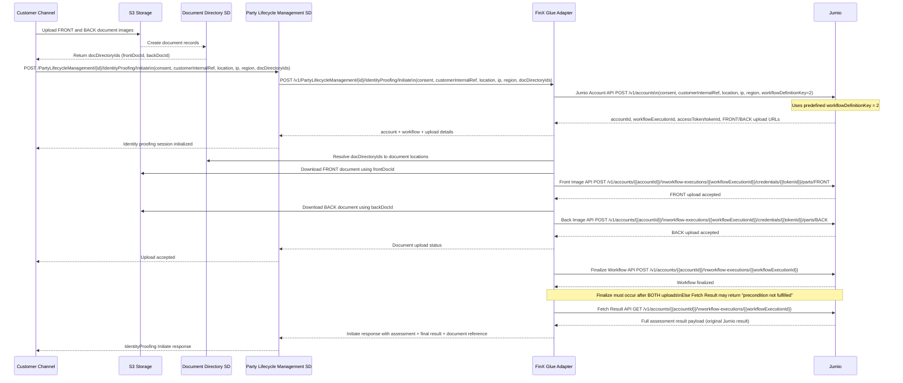

# Identity Verification

## End-to-end Identity Proofing Flow (BIAN + Jumio + FinX Glue)

## Explanation

### 1. Pre-step — Customer Uploads Documents to S3 and Gets Document Directory IDs

**Trigger:** Before initiating identity proofing, the Customer Channel uploads FRONT and BACK document images to S3.

The upload operation creates records in the Document Directory SD. The channel receives `docDirectoryIds` (for example, `frontDocId` and `backDocId`) that reference those stored documents.

---

### 2. Initiate Identity Proofing from Customer Channel

**API:** `POST /PartyLifecycleManagement/{id}/IdentityProofing/Initiate`

The Customer Channel initiates identity proofing by calling Party Lifecycle Management SD and passing:
- Customer consent
- Customer internal reference
- Location, IP address, and region
- `docDirectoryIds` from Document Directory SD

---

### 3. Transfer Request from Party Lifecycle Management SD to FinX Glue Adapter

**API:** `POST /PartyLifecycleManagement/{id}/IdentityProofing/Initiate` (forwarded internally)

The Party Lifecycle Management BIAN service forwards the Initiate request and `docDirectoryIds` to the FinX Glue Adapter to begin the Jumio workflow.

---

### 4. Step 1 — Jumio Account API (Integration to Jumio via Glue)

**API:** `POST https://account.emea-1.jumio.ai/api/v1/accounts`

The FinX Glue Adapter transforms and forwards the request to Jumio's Account Creation API with:
- User consent
- Customer internal reference
- Location, IP, and region
- Workflow definition key (fixed as `2`)

**Output:** Jumio returns `accountId`, `workflowExecutionId`, `accessToken`/`tokenId`, and FRONT/BACK image upload URLs.

---

### 5. Step 2 — FinX Glue Resolves and Downloads FRONT Document

Using the `docDirectoryIds`, FinX Glue Adapter resolves document metadata from Document Directory SD, then downloads the FRONT image from S3.

**API to Jumio:** `POST https://api.emea-1.jumio.ai/api/v1/accounts/{{accountId}}/workflow-executions/{{workflowExecutionId}}/credentials/{{tokenId}}/parts/FRONT`

The downloaded FRONT image is uploaded by FinX Glue Adapter to Jumio as multipart content.

**Output:** Jumio acknowledges FRONT image upload acceptance.

---

### 6. Step 3 — FinX Glue Downloads and Uploads BACK Document

FinX Glue Adapter downloads the BACK image from S3 using the corresponding Document Directory ID.

**API to Jumio:** `POST https://api.emea-1.jumio.ai/api/v1/accounts/{{accountId}}/workflow-executions/{{workflowExecutionId}}/credentials/{{tokenId}}/parts/BACK`

The BACK image is uploaded by FinX Glue Adapter to Jumio.

**Output:** Jumio acknowledges BACK image upload acceptance. The channel is notified that both uploads are accepted.

---

### 7. Step 4 — Finalize Workflow

**API:** `POST https://api.emea-1.jumio.ai/api/v1/accounts/{{accountId}}/workflow-executions/{{workflowExecutionId}}`

Once both FRONT and BACK images are uploaded, FinX Glue Adapter calls Jumio's Finalize Workflow API to indicate all credential parts are ready.

> ⚠️ **Important:** Both images must be uploaded before this call. Calling Finalize prematurely may result in a `"precondition not fulfilled"` error when fetching results.

---

### 8. Step 5 — Fetch Verification Result

**API:** `GET https://retrieval.emea-1.jumio.ai/api/v1/accounts/{{accountId}}/workflow-executions/{{workflowExecutionId}}`

FinX Glue Adapter retrieves the full verification result from Jumio using the account ID and workflow execution ID.

**Output:** The full assessment result payload (original Jumio result) is returned to the adapter.

---

### 9. Final Output

**`200 OK`** — FinX Glue Adapter returns the complete Initiate response (assessment result + final decision + document reference) through Party Lifecycle Management SD back to the Customer Channel.

---
