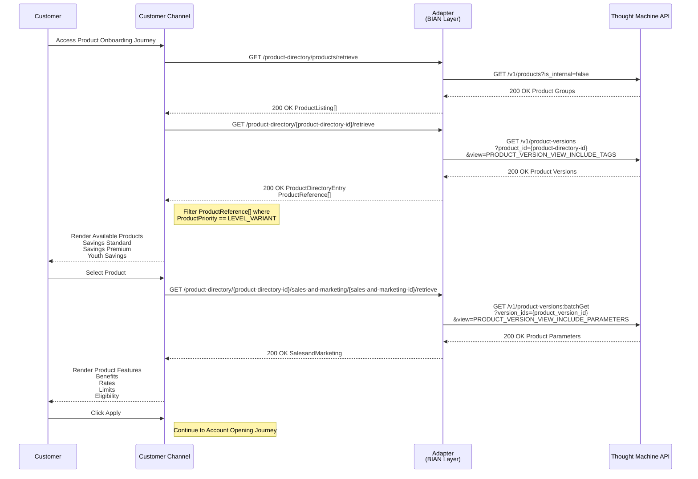

```mermaid
sequenceDiagram

    participant Customer as Customer

    participant Channel as Customer Channel

    participant Adapter as Adapter<br/>(BIAN Layer)

    participant Core as Thought Machine API


    Customer->>Channel: Access Product Onboarding Journey


    Channel->>Adapter: GET /product-directory/products/retrieve


    Adapter->>Core: GET /v1/products?is_internal=false

    Core-->>Adapter: 200 OK Product Groups


    Adapter-->>Channel: 200 OK ProductListing[]


    Channel->>Adapter: GET /product-directory/{product-directory-id}/retrieve


    Adapter->>Core: GET /v1/product-versions<br/>?product_id={product-directory-id}<br/>&view=PRODUCT_VERSION_VIEW_INCLUDE_TAGS


    Core-->>Adapter: 200 OK Product Versions


    Adapter-->>Channel: 200 OK ProductDirectoryEntry<br/>ProductReference[]


    Note right of Channel: Filter ProductReference[] where<br/>ProductPriority == LEVEL_VARIANT


    Channel-->>Customer: Render Available Products<br/>Savings Standard<br/>Savings Premium<br/>Youth Savings


    Customer->>Channel: Select Product


    Channel->>Adapter: GET /product-directory/{product-directory-id}/sales-and-marketing/{sales-and-marketing-id}/retrieve


    Adapter->>Core: GET /v1/product-versions:batchGet<br/>?version_ids={product_version_id}<br/>&view=PRODUCT_VERSION_VIEW_INCLUDE_PARAMETERS


    Core-->>Adapter: 200 OK Product Parameters


    Adapter-->>Channel: 200 OK SalesandMarketing


    Channel-->>Customer: Render Product Features<br/>Benefits<br/>Rates<br/>Limits<br/>Eligibility


    Customer->>Channel: Click Apply


    Note right of Channel: Continue to Account Opening Journey
```
