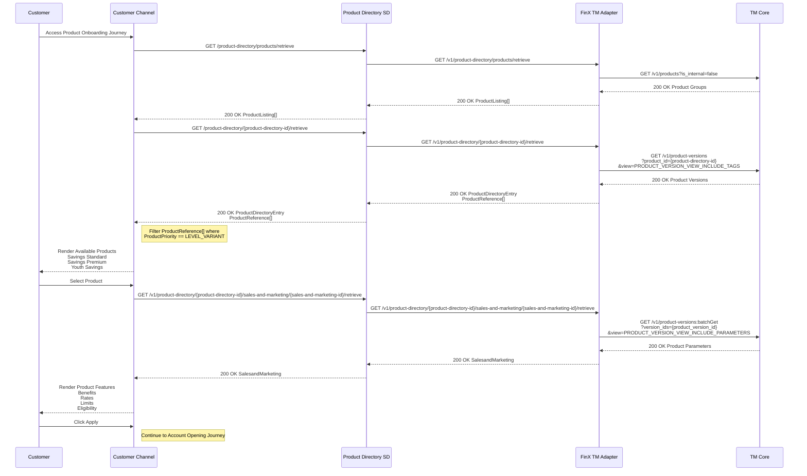

## Explanation

### 1. Customer Accesses Product Onboarding Journey

**Trigger:** The Customer accesses the Product Onboarding Journey via the Customer Channel. This initiates the flow to retrieve and display available product templates and variants.

---

### 2. Retrieve Product Listing from Product Directory SD

**API:** `GET /v1/product-directory/products/retrieve`

The Customer Channel calls the Product Directory SD to fetch the list of available products. The Product Directory SD forwards this request to the FinX TM Adapter.

**Integration to TM Core:**

**API:** `GET /v1/products?is_internal=false`

The adapter calls TM Core to retrieve all non-internal product groups.

**Output:** TM Core returns the product groups. The adapter maps and returns a `ProductListing[]` back through the Product Directory SD to the Customer Channel.

---

### 3. Retrieve Product Templates and Variants

**API:** `GET /product-directory/{product-directory-id}/retrieve`

The Customer Channel calls the Product Directory SD with a specific product directory ID to retrieve product versions and variants. The request is forwarded to the FinX TM Adapter.

**Integration to TM Core:**

**API:** `GET /v1/product-versions?product_id={product-directory-id}&view=PRODUCT_VERSION_VIEW_INCLUDE_TAGS`

The adapter calls TM Core to fetch all product versions associated with the given product, including tag metadata.

**Output:** TM Core returns the product versions. The adapter maps and returns a `ProductDirectoryEntry` with a `ProductReference[]` back to the channel.

> The Customer Channel filters the `ProductReference[]` where `ProductPriority == LEVEL_VARIANT` to identify available product variants (e.g., Savings Standard, Savings Premium, Youth Savings), which are then rendered to the customer.

---

### 4. Customer Selects a Product

The customer selects a product from the rendered list, triggering the retrieval of detailed product features.

---

### 5. Retrieve Product Sales and Marketing Details

**API:** `GET /v1/product-directory/{product-directory-id}/sales-and-marketing/{sales-and-marketing-id}/retrieve`

The Customer Channel calls the Product Directory SD to retrieve detailed sales and marketing information for the selected product. The request is forwarded to the FinX TM Adapter.

**Integration to TM Core:**

**API:** `GET /v1/product-versions:batchGet?version_ids={product_version_id}&view=PRODUCT_VERSION_VIEW_INCLUDE_PARAMETERS`

The adapter calls TM Core to fetch detailed product parameters (rates, limits, eligibility, etc.) for the selected product version.

**Output:** TM Core returns the product parameters. The adapter maps and returns a `SalesandMarketing` response back through the Product Directory SD to the Customer Channel, which renders the product features (Benefits, Rates, Limits, Eligibility) to the customer.

---

### 6. Customer Clicks Apply

**Output:** `200 OK` — The customer proceeds to the Account Opening Journey after reviewing the product details.
