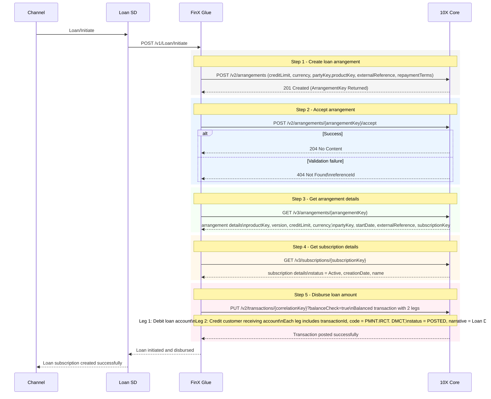

# Create loan at 10X

## Flow summary

Creating a loan subscription (account) in 10X involves these mandatory steps:

1. **Create arrangement** using loan amount, currency, customer Party Key, product key, external reference, and repayment terms.
2. **Accept arrangement** using the returned Arrangement Key.
3. **Get arrangement details** to confirm creation and retrieve the Subscription Key.
4. **Get subscription details** to verify the subscription is Active.
5. **Disburse the loan amount** using a balanced transaction with debit and credit legs submitted together.
