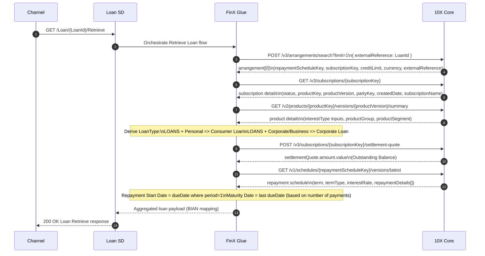

# Retrieve Loan Account - BIAN ~ 10X Adapter

```mermaid
sequenceDiagram
    autonumber
    participant C as Channel
    participant L as Loan SD
    participant G as FinX Glue
    participant X as 10X Core

    C->>L: GET /Loan/{LoanId}/Retrieve
    L->>G: Orchestrate Retrieve Loan flow

    G->>X: POST /v3/arrangements/search?limit=1\n{ externalReference: LoanId }
    X-->>G: arrangement[0]\n(repaymentScheduleKey, subscriptionKey, creditLimit, currency, externalReference)

    G->>X: GET /v3/subscriptions/{subscriptionKey}
    X-->>G: subscription details\n(status, productKey, productVersion, partyKey, createdDate, subscriptionName)

    G->>X: GET /v2/products/{productKey}/versions/{productVersion}/summary
    X-->>G: product details\n(interestType inputs, productGroup, productSegment)
    Note over G: Derive LoanType:\nLOANS + Personal => Consumer Loan\nLOANS + Corporate/Business => Corporate Loan

    G->>X: POST /v3/subscriptions/{subscriptionKey}/settlement-quote
    X-->>G: settlementQuote.amount.value\n(Outstanding Balance)

    G->>X: GET /v1/schedules/{repaymentScheduleKey}/versions/latest
    X-->>G: repayment schedule\n(term, termType, interestRate, repaymentDetails[])
    Note over G: Repayment Start Date = dueDate where period=1\nMaturity Date = last dueDate (based on number of payments)

    G-->>L: Aggregated loan payload (BIAN mapping)
    L-->>C: 200 OK Loan Retrieve response
```
